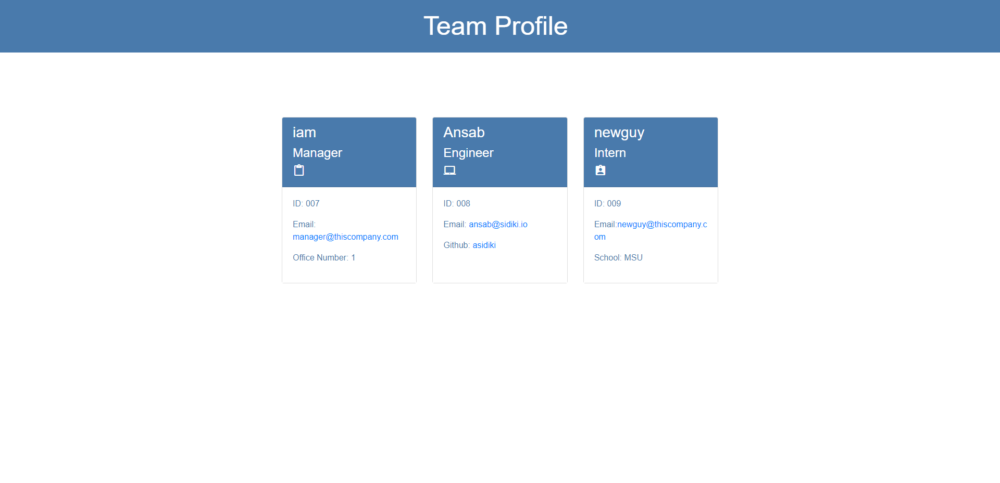

# Team Profile Generator

## Description 
This application was built for a MSU bootcamp challenge.
App generates a team profile based on user input. I leverages the Node.js Inquirer module and displayed the info on a newly created html page.
OOP and TDD using jest was used.

## Installation 
The user should clone the repository from GitHub and download Node. This application also requires a file system and inquirer module. If testing is required, this application uses Jest. 

## Usage 
Use inquirer from your command line to answer questions about your project.
View walk through video here - [Screencastify](./assets/images/gif.gif) 

## Tests
Run `npm test` to run Jest for tests on constructors.

## Author
Ansab Sidiki - https://github.com/asidiki